footer: *Network Security*
slidenumbers: true
autoscale: true

---
# Network Security
## Keshav Dulal
#### *keshavdulal.com.np*

<!-- ---
#Keshav Dulal

### CS Engineer
Frontend Developer @Leapfrog Tech.
BTEC Faculty @SNC -->

---
### Course Detail - Network Security (CSC-455)

---
# Why do we need
#[fit] Network Security ?

<!-- --- -->
<!--  -->

<!-- --- -->
<!--  -->

---
- Synopsis - Study of different network security concepts and methods
- Goal - In this age of universal electronic connectivity, viruses and hackers, electronic eavesdropping and electronic fraud, security is paramount. This course provides a practical survey of the principles and practice of network security.

---
#Course Content
### 8 Chapters - 45 hrs

---
#Course Content
1. Introduction
2. [Key Management and Distribution](https://github.com/Keshavdulal/bscit-network-security-notes/blob/master/bscit-ns-u2-key-mgmt.md)
3. [User Authentication Protocols](https://github.com/Keshavdulal/bscit-network-security-notes/blob/master/bscit-ns-u3-user-auth.md)
4. [Transport Level Security](https://github.com/Keshavdulal/bscit-network-security-notes/blob/master/bscit-ns-u4-tls.md)
5. [Wireless Network Security](https://github.com/Keshavdulal/bscit-network-security-notes/blob/master/bscit-ns-u5-wireless-security.md)
6. [Electronic Mail Security](https://github.com/Keshavdulal/bscit-network-security-notes/blob/master/bscit-ns-u6-email-security.md)
7. [IP Security](https://github.com/Keshavdulal/bscit-network-security-notes/blob/master/bscit-ns-u7-ipsecurity.md)
8. [Cyber Security](https://github.com/Keshavdulal/bscit-network-security-notes/blob/master/bscit-ns-u8-cybersecurity.md)

---
##Unit 1 - Introduction to Network Security
1. Computer Security Concepts
1. The OSI Security Architecture
    - Security Attacks
    - Security Services
    - Security Mechanisms
1. A Model for Network Security

---
# Computer Security Concepts

---
# Computer Security Concepts
1. A Definition of Computer Security
1. CIA Triad
1. The Challenges of Computer Security

---
# Definition - Computer Security
*The protection afforded to an automated information system in order to attain the applicable objectives of preserving the integrity, availability, and confidentiality of information system resources (includes hardware, software, firmware, information data, and telecommunications).*
- The NIST *Computer Security Handbook* [NIST95]

---
# Cryptography & Network Security (5th Edition)
> by William Stallings & Prentice Hall

---
#CIA TRIAD
It is a model designed to guide policies for information security within an organization.
## Confidentiality
## Integrity
## Availability

---
## 1. Confidentiality
### Data confidentiality
Assures that private or confidential information is not made available or disclosed to unauthorized individuals.
### Privacy
Assures that individuals control or influence what information related to them may be collected and stored and by whom and to whom that information may be disclosed.

---
## 2. Integrity
### Data integrity
Assures that information and programs are changed only in a specified and authorized manner.
### System integrity
Assures that a system performs its intended function in an unimpaired manner, free from deliberate or inadvertent unauthorized manipulation of the system.

---
## 3. Availability
Assures that systems work promptly and service is not denied to authorized users.

---
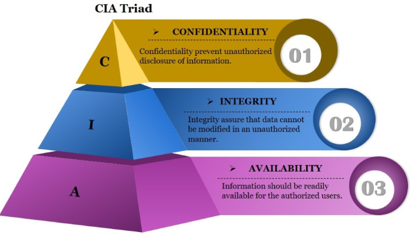

---
# Additional Concepts
## 4. Authenticity
## 5. Accountability

---
## 4. Authenticity
The property of being genuine and being able to be verified and trusted; confidence in the validity of a transmission, a message, or message originator. This means verifying that users are who they say they are and that each input arriving at the system came from a trusted source.

---
## 5. Accountability
The security goal that generates the requirement for actions of an entity to be traced uniquely to that entity. This supports nonrepudiation, deterrence, fault isolation, intrusion detection and prevention, and after-action recovery and legal action. Because truly secure systems are not yet an achievable goal, we must be able to trace a security breach to a responsible party. Systems must keep records of their activities to permit later forensic analysis to trace security breaches or to aid in transaction disputes.

---
<!-- *Daily Assignment* -->
## The challenges of computer security

---
# 1
 Security is not as simple as it might first appear to the novice. The requirements seem to be straightforward; indeed, most of the major requirements for security services can be given self-explanatory, one-word labels: confidentiality, authentication, nonrepudiation, or integrity. But the mechanisms used to meet those requirements can be quite complex, and understanding them may involve rather subtle reasoning.

---
# 2
In developing a particular security mechanism or algorithm, one must always consider potential attacks on those security features. In many cases, successful attacks are designed by looking at the problem in a completely different way, therefore exploiting an unexpected weakness in the mechanism.

---
# 3
Because of point 2, the procedures used to provide particular services are often counterintuitive.Typically, a security mechanism is complex, and it is not obvious from the statement of a particular requirement that such elaborate measures are needed. It is only when the various aspects of the threat are considered that elaborate security mechanisms make sense.

---
# 4
Having designed various security mechanisms, it is necessary to decide where to use them. This is true both in terms of physical placement (e.g., at what points in a network are certain security mechanisms needed) and in a logical sense [e.g., at what layer or layers of an architecture such as TCP/IP (Transmission Control Protocol/Internet Protocol) should mechanisms be placed].

---
# 5
Security mechanisms typically involve more than a particular algorithm or protocol. They also require that participants be in possession of some secret information (e.g., an encryption key), which raises questions about the creation, distribution, and protection of that secret information. There also may be a reliance on communications protocols whose behavior may complicate the task of developing the security mechanism. For example, if the proper functioning of the security mechanism requires setting time limits on the transit time of a message from sender to receiver, then any protocol or network that introduces variable, unpredictable delays may render such time limits meaningless.

---
# 6
Computer and network security is essentially a battle of wits between a perpetrator who tries to find holes and the designer or administrator who tries to close them. The great advantage that the attacker has is that he or she need only find a single weakness, while the designer must find and eliminate all weaknesses to achieve perfect security.

---
# 7
There is a natural tendency on the part of users and system managers to perceive little benefit from security investment until a security failure occurs.

---
# 8
Security requires regular, even constant, monitoring, and this is difficult in today’s short-term, overloaded environment.

---
# 9
Security is still too often an afterthought to be incorporated into a system after the design is complete rather than being an integral part of the design process.

---
# 10 
Many users and even security administrators view strong security as an impediment to efficient and user-friendly operation of an information system or use of information.

---
## D2 - Agendas
1. The OSI Security Architecture

---
# The OSI Security Architecture
*OSI: Open Systems Interconnection*

- Defines a systematic approach of providing security
- Developed as an international standard
- Development of security features for products and services are based on its structured definition

---
# The OSI Security Architecture defines :
1. Security Attacks (2)
2. Security Services (5)
3. Security Mechanisms (8)

---
# Security Attacks 🎯
Any action that compromises the security of information owned by an organization.
- Passive Attacks
- Active Attacks

---
## Security Attacks
1. Passive Attacks
- A passive attack attempts to learn or make use of information from the system but does not affect system or its  resources.
- Difficult to detect as they do not involve alteration of data.
- Preventable to some extent using encryption.
2. Active Attacks
- An active attack attempts to alter system resources or affect their operation.

---
# Passive Attacks
- Release of message Contents
- Traffic Analysis

---
## 1.Release of message Contents
A telephone conversation, an electronic mail message, and a transferred file may contain sensitive or confidential information.

---
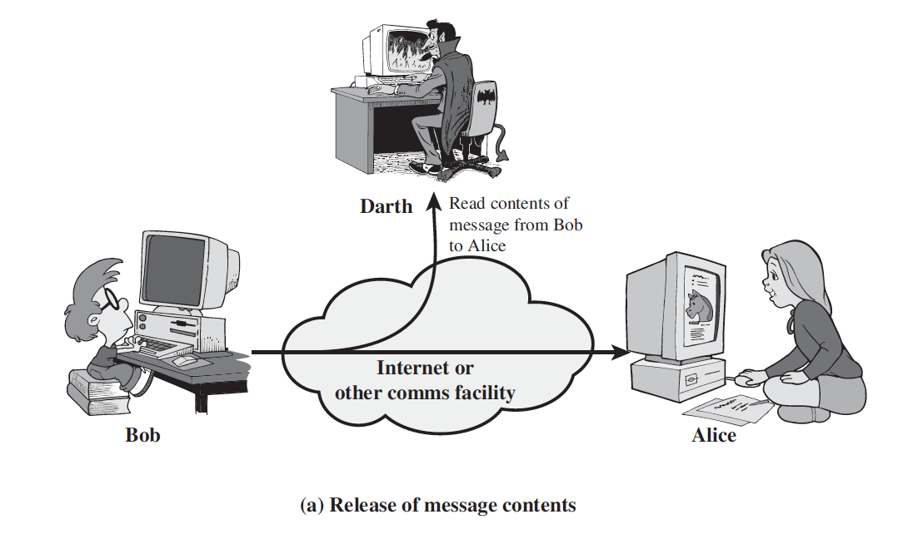

---
## 2.Traffic Analysis
- Subtle form of attack
- Determine location/origin of hosts
- Observe frequency and length of messages being exchanged.

---
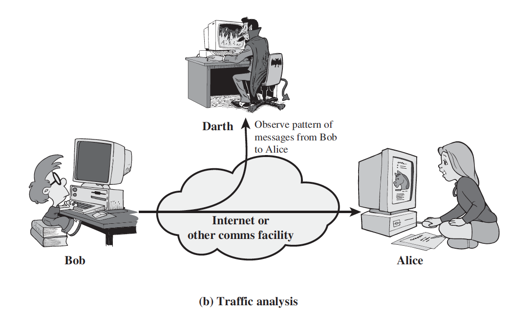

---
# Active Attacks
- Masquerade
- Replay
- Modification of messages
- DOS (Denial of Service)

---
## 1. Masquerade
- A masquerade takes place when one entity pretends to be a different entity. A masquerade attack usually includes one of the other forms of active attack.
- For example, authentication sequences can be captured and replayed after a valid authentication sequence has taken place, thus enabling an authorized entity with few privileges to obtain extra privileges by impersonating an entity that has those privileges.

---
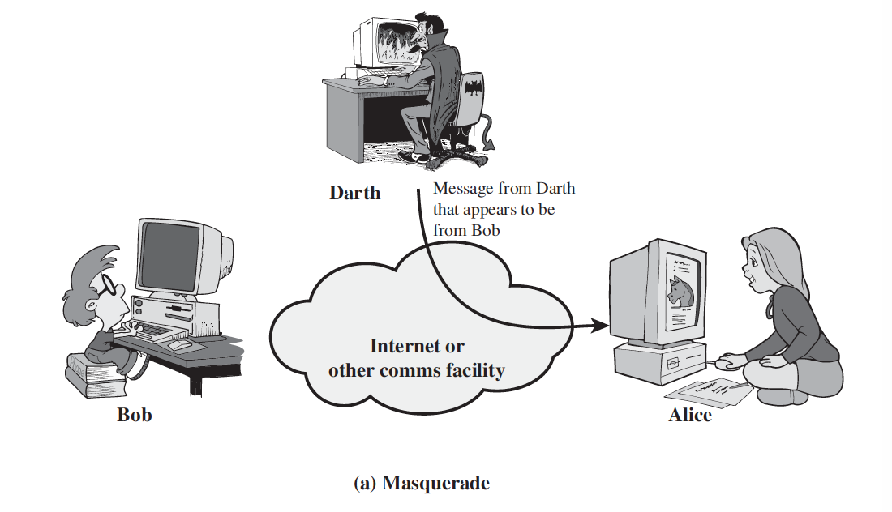

---
## 2. Replay
Replay involves the passive capture of a data unit and its subsequent retransmission to produce an unauthorized effect

---
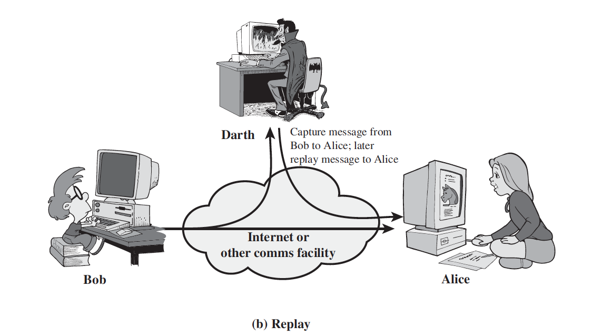

---
## 3. Modification of messages
- Modification of messages simply means that some portion of a legitimate message is altered, or that messages are delayed or reordered, to produce an unauthorized effect.
- For example, a message meaning “Allow John Smith to read confidential file accounts” is modified to mean “Allow Fred Brown to read confidential file accounts.”

---
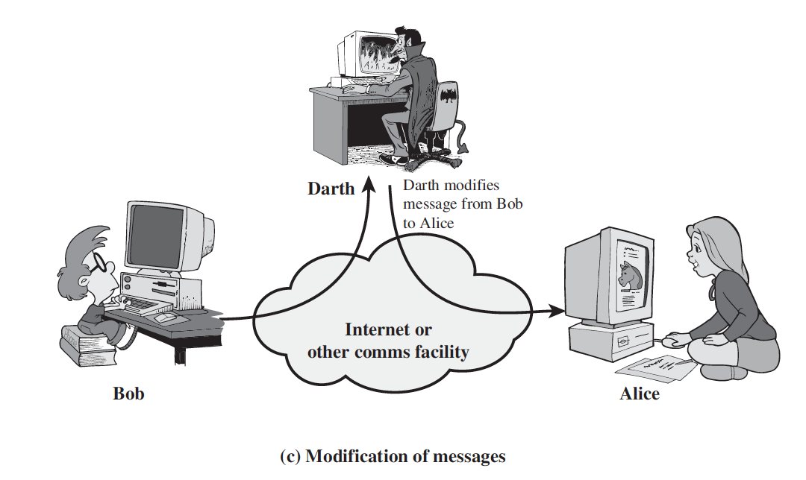

---
## 4. DOS (Denial of Service)
- The denial of service prevents the normal use of facilities. This attack may have a specific target.
- It is the disruption of an entire network, either by disabling the network or by overloading it with messages so as to degrade performance.
- For example, an entity may suppress all messages directed to a particular destination

---
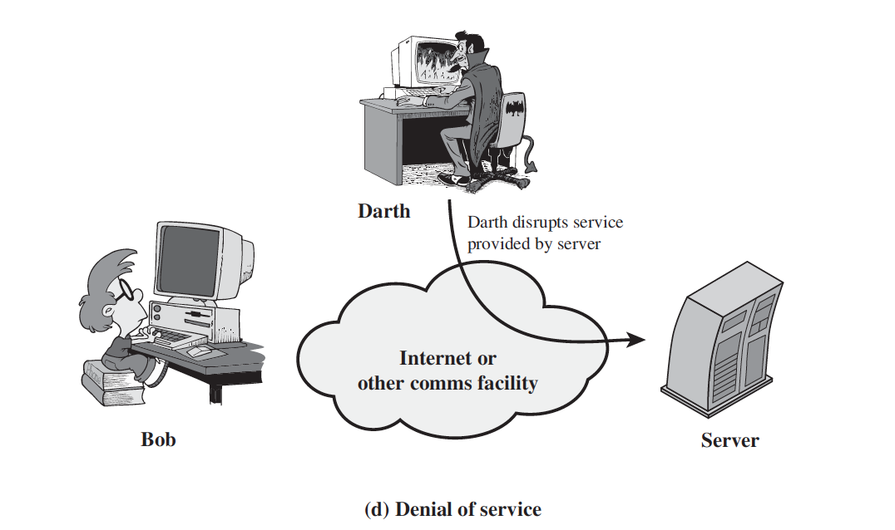

---
# The OSI Security Architecture:
1. Security Attacks (2) ✅
- Passive Attacks ✓
- Active Attacks ✓
2. Security Services (5)
3. Security Mechanisms (8)

---
# Security Services
### Definition:
A processing or communication service that enhances the security of the data processing systems and the information transfers of an organization. The services are intended to counter security attacks, and they make use of one or more security mechanisms to provide the service.

---
# Security Services
- Authentication
- Access Control
- Data Confidentiality
- Data Integrity
- Nonrepudiation

---
# 1. Authentication Service
- The assurance that the communicating entity is the one that it claims to be.
- In the case of a single message, such as a warning or alarm signal, the function of the authentication service is to assure the recipient that the message is from the source that it claims to be from.
- In the case of an ongoing interaction, such as the connection of a terminal to a host, two aspects are involved.
- First, at the time of connection initiation, the service assures that the two entities are authentic, that is, that each is the entity that it claims to be.
- Second, the service must assure that the connection is not interfered with in such a way that a third party can masquerade as one of the two legitimate parties for the purposes of unauthorized transmission or reception.

---
<!-- Daily Assignment - D1 -->
# Authentication Service
- Peer Entity Authentication
- Data Origin Authentication

---
# 2. Access Control Service
- Access control is the ability to limit and control the access to host systems and applications via communications links.
- To achieve this, each entity trying to gain access must first be identified, or authenticated, so that access rights can be tailored to the individual.
- For example, Access to internet of volume-based user is determined by his/her volume usage.

---
# 3. Data Confidentiality Service
- The protection of data from unauthorized disclosure.
- With respect to the content of a data transmission, several levels of protection can be identified.

---
<!-- Daily Assignment - D1 -->
# Data Confidentiality
- Connection Confidentiality
The protection of all user data on a connection.
- Connectionless Confidentiality
The protection of all user data in a single data block
- Selective-Field Confidentiality
The confidentiality of selected fields within the user data on a connection.
- Traffic-Flow Confidentiality
The protection of the information that might be derived from observation of traffic flows.

---
# 4. Data Integrity Service
The assurance that data received are exactly as sent by an authorized entity (i.e., contain no modification, insertion, deletion, or replay).

---
# 5. Nonrepudiation Service
Provides protection against denial by one of the entities involved in a communication of having participated in all or part of the communication.
Nonrepudiation prevents either sender or receiver from denying a transmitted message.
Thus, when a message is sent, the receiver can prove that the alleged sender in fact sent the message.

---
# The OSI Security Architecture:
1. Security Attacks (2) ✅
2. Security Services (5) ✅
- Authentication Services ✓
- Access Control Services ✓
- Data Confidentiality Services ✓
- Data Integrity Services ✓
- Nonrepudiation Services ✓
3. Security Mechanisms (8)

---
# 3. Security Mechanisms
Incorporated into the appropriate protocol layer in order to provide some of the OSI security services.

---
# Security Mechanisms
- Encipherment
- Digital Signature
- Access Control
- Data Integrity
- Authentication Exchange
- Traffic Padding
- Routing Control
- Notarization

---
# 1. Encipherment
The use of mathematical algorithms to transform data into a form that is not readily intelligible. The transformation and subsequent recovery of the data depend on an algorithm and zero or more encryption keys.

---
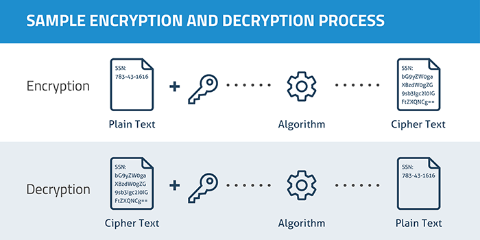

---
# 2. Digital Signature
Data appended to, or a cryptographic transformation of, a data unit that allows a recipient of the data unit to prove the source and integrity of the data unit and protect against forgery (e.g., by the recipient).

---
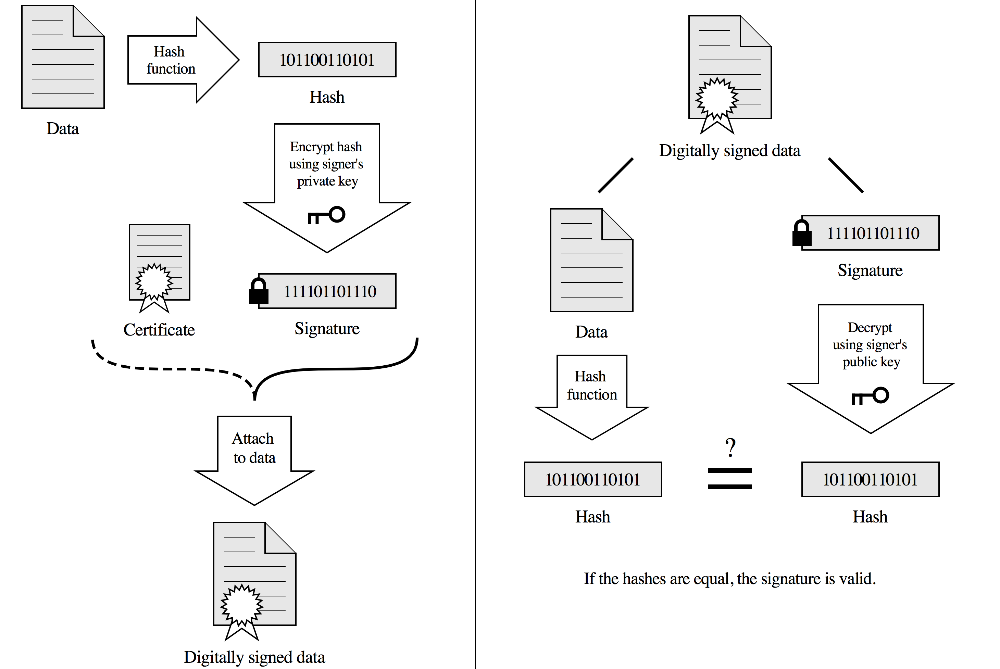

---

# 3. Access Control
A variety of mechanisms that enforce access rights to resources.

---
# 4. Data Integrity
A variety of mechanisms used to assure the integrity of a data unit or stream of data units.

---
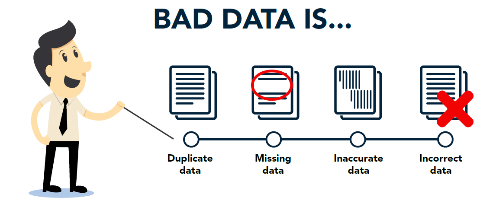

---
# 5. Authentication Exchange
A mechanism intended to ensure the identity of an entity by means of information exchange.

---
# 6. Traffic Padding
The insertion of bits into gaps in a data stream to frustrate traffic analysis attempts.

---
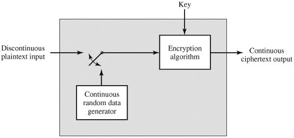

---
# 7. Routing Control
Enables selection of particular physically secure routes for certain data and allows routing changes, especially when a breach of security is suspected.

---
# 8. Notarization
The use of a trusted third party to assure certain properties of a data exchange.

---
# PERVASIVE SECURITY MECHANISMS
Mechanisms that are not specific to any particular OSI security service or protocol layer.

- Trusted Functionality
- Security Label
- Event Detection
- Security Audit Trail
- Security Recovery

---
# 1. Trusted Functionality
That which is perceived to be correct with respect to some criteria (e.g., as established by a security policy).

---
# 2. Security Label
The marking bound to a resource (which may be a data unit) that names or designates the security attributes of that resource.

---
# 3. Event Detection
Detection of security-relevant events.

---
# 4. Security Audit Trail
Data collected and potentially used to facilitate a security audit, which is an independent review and examination of system records and activities.

---
# 5. Security Recovery
Deals with requests from mechanisms, such as event handling and management functions, and takes recovery actions.

---
# The OSI Security Architecture:
1. Security Attacks (2) ✅
2. Security Services (5) ✅
3. Security Mechanisms (8) ✅

---
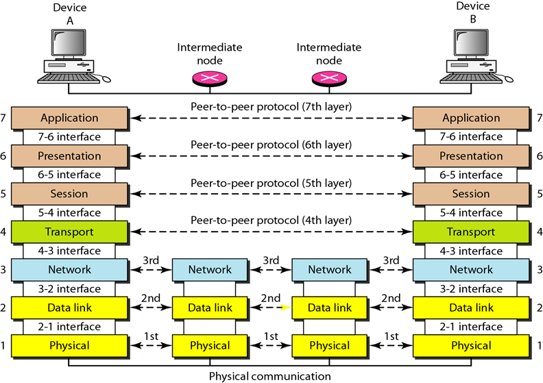

---
# A Model for Network Security

---
## All the techniques for providing security have two components:
1. Encryption - A security-related transformation on the information to be sent.
- Examples include the encryption of the message, which scrambles the message so that it is unreadable by the opponent, and the addition of a code based on the contents of the message, which can be used to verify the identity of the sender.

2. Information - Some secret information shared by the two principals and, it is hoped, unknown to the opponent.
- An example is an encryption key used in conjunction with the transformation to scramble the message before transmission and unscramble it on reception.

---
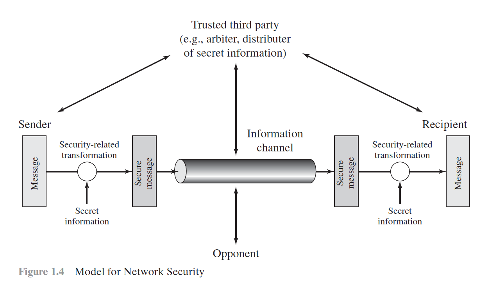

---
# Four basic tasks in designing a security service:
1. Design a good/secure algorithm.
2. Generate the necessary secret information.
3. Develop methods for distributing the secret information.
4. Specify a protocol to be used.

---
# Four basic tasks in designing a security service:
1. Design an algorithm for performing the security-related transformation. The algorithm should be such that an opponent cannot defeat its purpose.
2. Generate the secret information to be used with the algorithm.
3. Develop methods for the distribution and sharing of the secret information.
4. Specify a protocol to be used by the two principals that makes use of the security algorithm and the secret information to achieve a particular security service.

---
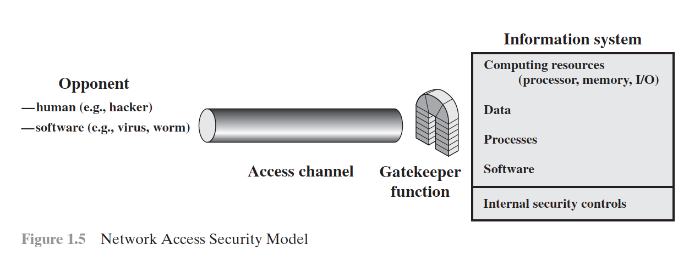

---
>There is no substitute for hard work.
-- Thomas Edison
