footer: *Network Security*
slidenumbers: true
autoscale: true

# UNIT 2
# Key Management and Distribution

---
# UNIT 2 - Key Management and Distribution
- Symmetric Key Distribution Using Symmetric Encryption
- Symmetric Key Distribution Using Asymmetric Encryption
- Distribution of Public Keys
- X.509 Certificates
- Public Key Infrastructure

---
## Key Management and Distribution

---
##[fit] Key Management and Distribution

### Key distribution is the function that delivers a key to two parties who wish to exchange secure encrypted data. Some sort of mechanism or protocol is needed to provide for the secure distribution of keys.

---
### Public-key encryption schemes are secure only if the authenticity of the public key is assured. A public-key certificate scheme provides the necessary security.

---
### X.509 defines the format for public-key certificates. This format is widely used in a variety of applications.

---
### A public-key infrastructure (PKI) is defined as the set of hardware, software, people, policies, and procedures needed to create, manage, store, distribute, and revoke digital certificates based on asymmetric cryptography.

---
### Typically, PKI implementations make use of X.509 certificates.

---
# How to share the Key ?

---
# 4 Ways to share keys
1. A can select a key and physically deliver it to B.
2. A third party can select the key and physically deliver it to A and B.
3. If A and B have previously and recently used a key, one party can transmit the new key to the other, encrypted using the old key.
4. If A and B each has an encrypted connection to a third party C, C can deliver a key on the encrypted links to A and B.

---
# Factors affecting End-to-end encryption
1. No. of Hosts at IP level
If N no of hosts then the no of keys required is
[N(N-1)]/2

2. No of Hosts and processes at Application Level

---
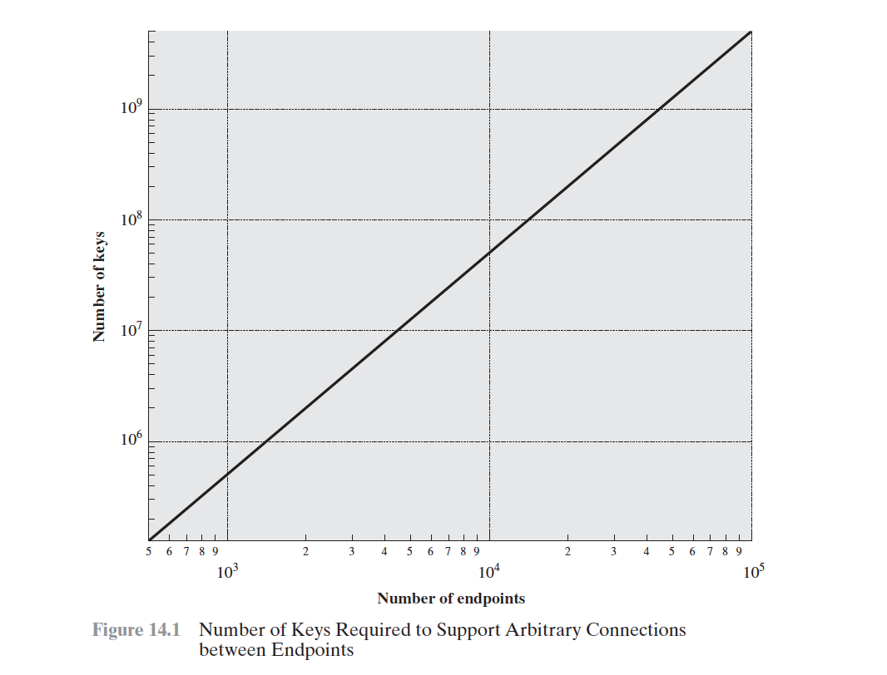

---
# Key Distribution Scenario
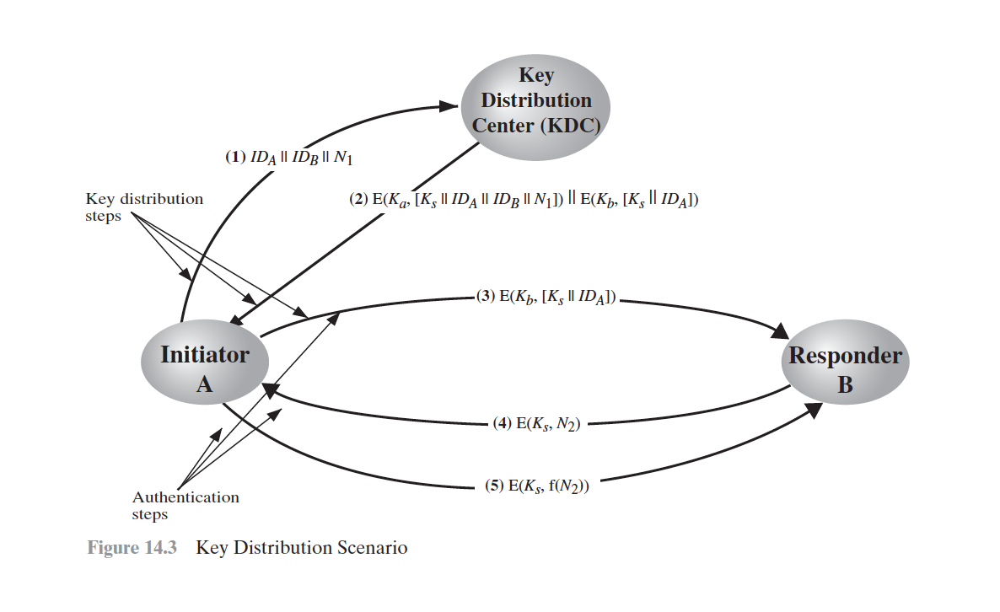

---

---
# Assumptions
- Let us assume that user A wishes to establish a logical connection with B and requires a one-time session key to protect the data transmitted over the connection.
- A has a master key, Ka , known only to itself and the KDC; similarly, B shares the master key Kb with the KDC.

---
# Steps Overview

---
# Step 1
A sends areques to IDa || IDb || N1 to KDC where
IDa -> Identitiy of A
IDb -> Identitiy of B
N1 -> Unique Identifier (Nonce)

---
# Step 2
KDC Responds back with a message encrypted with Ka

- Message Intended for A
Ks -> One time session key
Original Message Sent by A

- Message Intended for B
Ks -> One time session key
IDa -> An identifier of A

- Message for B is encrypted with Kb

---
# Step 3
A sends the message intended for B sent by KDC
E(Kb, [Ks || IDa])
Kb -> Master key of B
Ks -> Session Key
IDa -> Unique Identifier of A

---
# Step 4
Using the newly minted session key for encryption, B sends a nonce, N2, to A.

---
# Step 5
Using *Ks*,A responds with *f(N2)*, where f is a function that performs some transformation on *N2*.

---
# Steps Detail
1. A issues a request to the KDC for a session key to protect a logical connection to B.The message includes the identity of A and B and a unique identifier, *N1*, for this transaction, which we refer to as a nonce. The nonce may be a timestamp, a counter, or a random number; the minimum requirement is that it differs with each request. Also, to prevent masquerade, it should be difficult for an opponent to guess the nonce.Thus, a random number is a good choice for a nonce.

2. The KDC responds with a message encrypted using *Ka*. Thus,A is the only one who can successfully read the message, and A knows that it originated at the KDC.The message includes two items intended for A:
• The one-time session key *Ks*, , to be used for the session
• The original request message, including the nonce, to enable A to match this response with the appropriate request
Thus,A can verify that its original request was not altered before reception by the KDC and, because of the nonce, that this is not a replay of some previous request.
In addition, the message includes two items intended for B:
• The one-time session key, *Ks*, to be used for the session
• An identifier of A (e.g., its network address), *IDa*
These last two items are encrypted with *Kb* (the master key that the KDC shares with B).They are to be sent to B to establish the connection and prove A’s identity.

3. A stores the session key for use in the upcoming session and forwards to B the information that originated at the KDC for B, namely, *E(Kb, [Ks || IDa])* Because this information is encrypted with *Kb*, it is protected from eavesdropping.
B now knows the session key *Ks*, knows that the other party is A (from *IDa*), and knows that the information originated at the KDC (because it is encrypted using *Kb*).
At this point, a session key has been securely delivered to A and B, and
they may begin their protected exchange. However, two additional steps are
desirable:

4. Using the newly minted session key for encryption, B sends a nonce, *N2*, to A.

5. Also, using *Ks*,A responds with *f(N2)*, where f is a function that performs some transformation on *N2*(e.g., adding one).

---
# Hierarchical Key Control
- Implementation of Multiple KDCs
- Local KDC -> Responsible for small domain
- Global KDC -> Responsible for connecting Local KDCs

---
# Session Key Lifetime
- For connection-oriented protocols
- For a connectionless protocols

---
# For connection-oriented protocols
one obvious choice is to use the same session key for the length of time that the connection is open, using a new session key for each new session. If a logical connection has a very long lifetime, then it would be prudent to change the session key periodically, perhaps every time the PDU (protocol data unit) sequence number cycles.

---
# For a connectionless protocols
such as a transaction-oriented protocol, there is no explicit connection initiation or termination. Thus, it is not obvious how often one needs to change the session key.The most secure approach is to use a new session key for each exchange. However, this negates one of the principal benefits of connectionless protocols, which is minimum overhead and delay for each transaction. A better strategy is to use a given session key for a certain fixed period only or for a certain number of transactions.

---
# A Transparent Key Control Scheme
- Connection-oriented end-to-end protocol

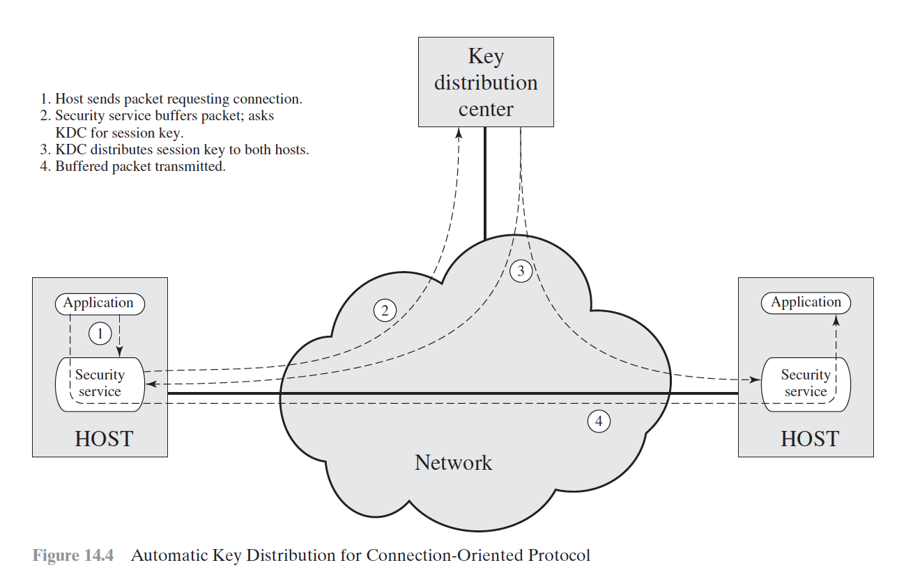

---
1. Host sends packet requesting connection.
2. Security service buffers packet; asks KDC for session key.
3. KDC distributes session key to both hosts.
4. Buffered packet transmitted.

---

---
# Decentralized Key Control
- Discourages the use of KDC
- Useful within a local context

---
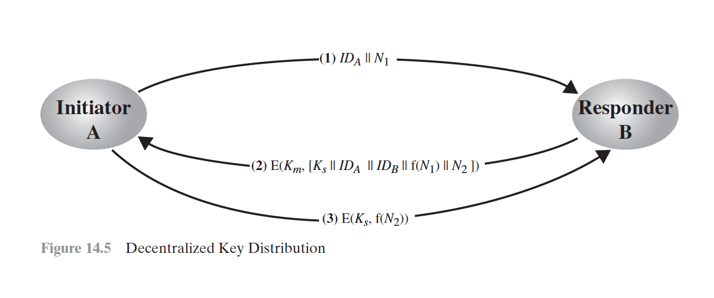

---
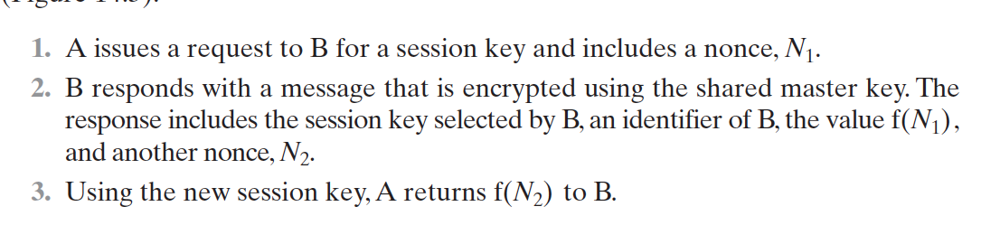

---
# Controlling Key Usage
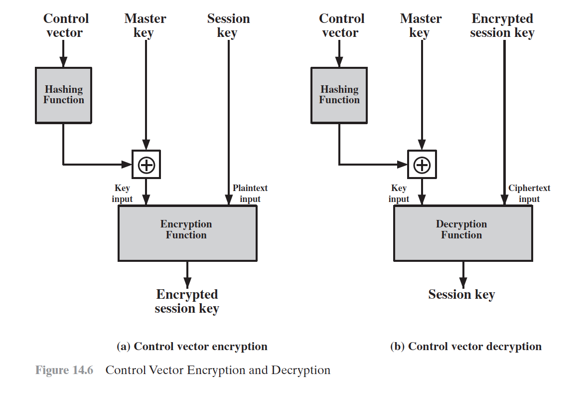

---

---
# Symmetric Key Distribution using asymmetric encryptions

- Simple Secret Key Distribution
- Secret Key Distribution with Confidentiality and Authentication
- A Hybrid Scheme

---
# Simple Secret Key Distribution
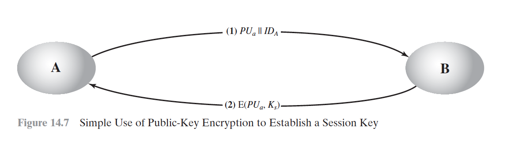

---

---
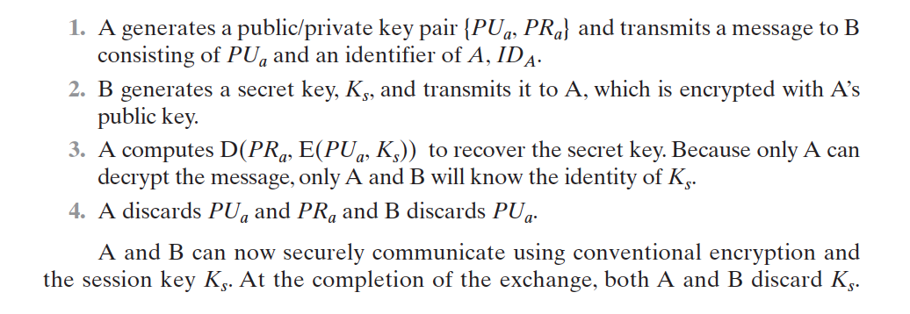

---
# MITM Attack

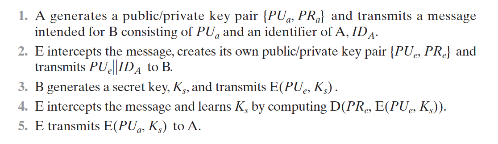

---

---
# Secret Key Distribution with Confidentiality and Authentication
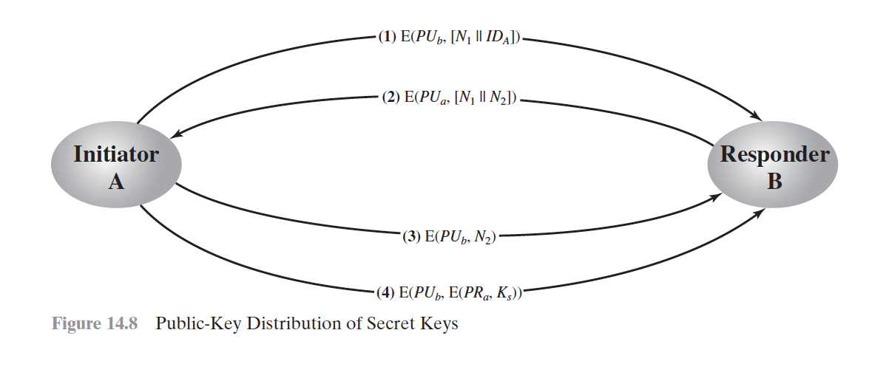

---

---
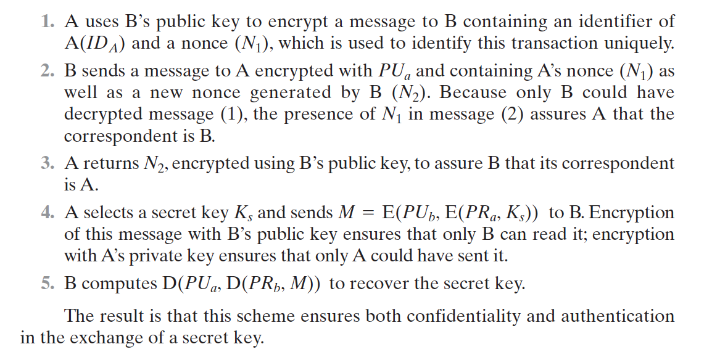

---
# A Hybrid Scheme

- Performance
- Backward Compatibility

---
# DISTRIBUTION OF PUBLIC KEYS

---
# DISTRIBUTION OF PUBLIC KEYS
• Public announcement
• Publicly available directory
• Public-key authority
• Public-key certificates

---
# Public announcement
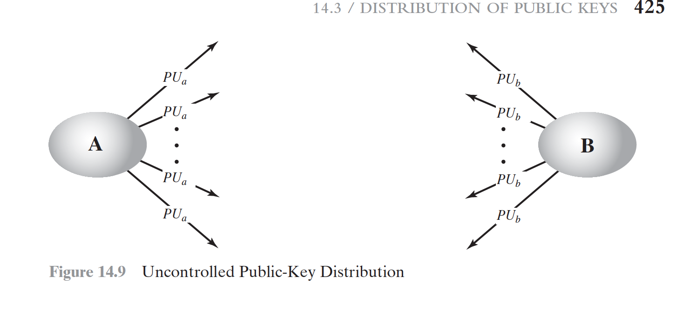

---

---
# Publicly available directory
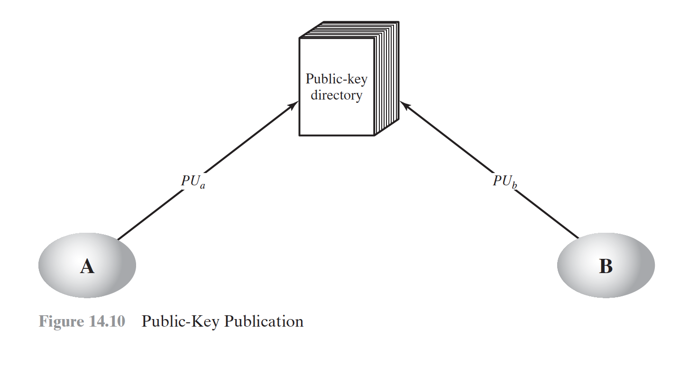

---

---
# Public-key authority
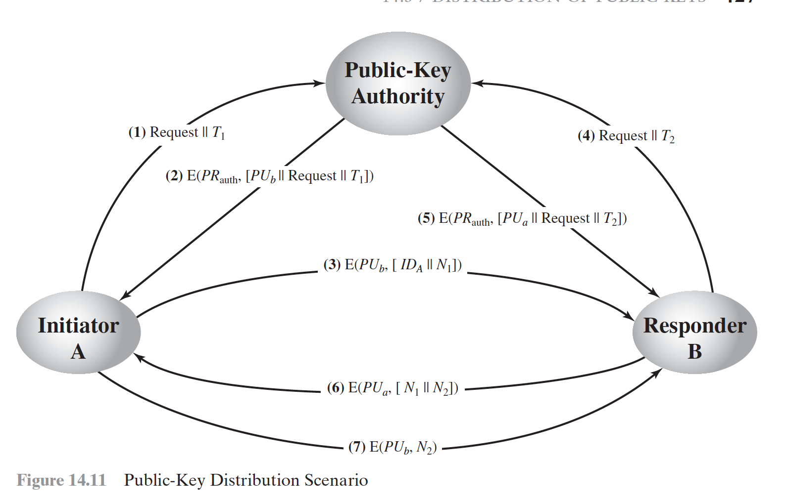

---

---
# Public-key certificates
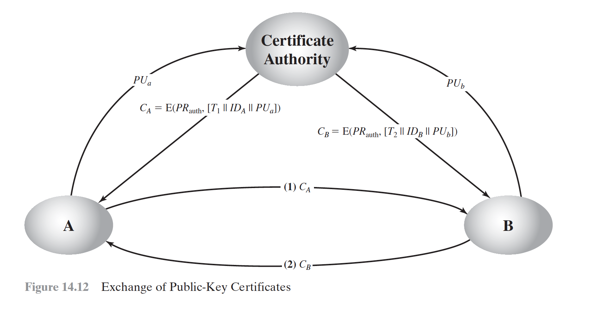

---

---
# X.509 Certificates
- 1988 -> 1990 -> 1993 -> 1995 ->2000

---
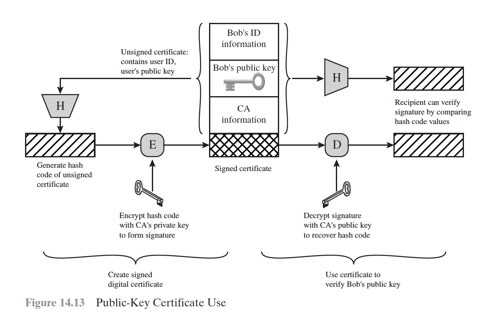

---
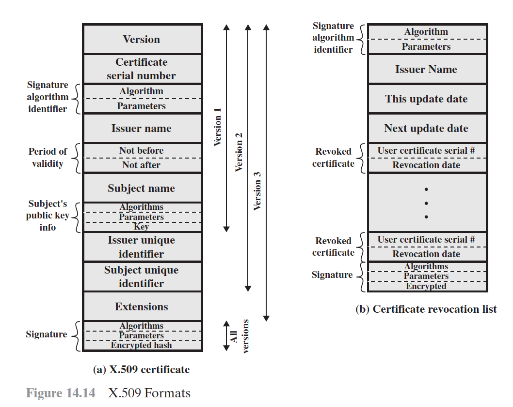

---
# PUBLIC-KEY INFRASTRUCTURE
- PKIX Architectural Model
- Elements of PKIX Architectural Model
- PKIX Management Functions

---
# PKIX Architectural Model

<!-- 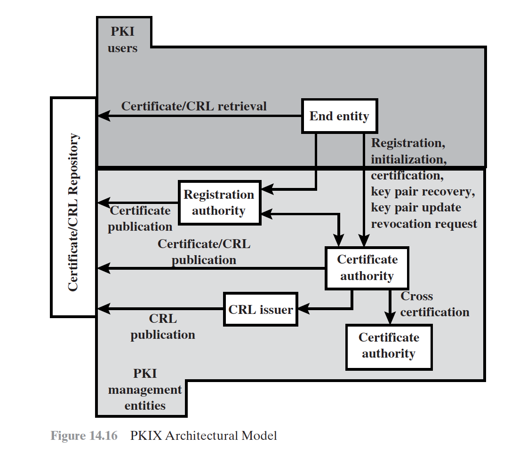 -->

---

---
# Elements of PKIX Architectural Model
- End entity
- Certification authority (CA)
- Registration authority (RA)
- CRL issuer
- Repository

---
# PKIX Management Functions
- Registration
- Initialization
- Certification
- Key pair recovery
- Key pair update
- Revocation request
- Cross certification

