<!-- footer: *Network Security* -->
<!-- slidenumbers: true -->
<!-- autoscale: true -->
<!-- build-lists: true -->

# BSCIT
# Network Security
# Unit 4
# Transport Level Security

---
## Unit 4
#[fit] Transport Level Security

---
# Topics
1. Web Security Issues
1. Secure Socket Layers (SSL)
1. Transport Layer Security (TLS)
1. HTTPS (HyperText Transfer Protocols)
1. Secure Shell (SSH)

---
#[fit] 4.1 *Web Security* Issues

---
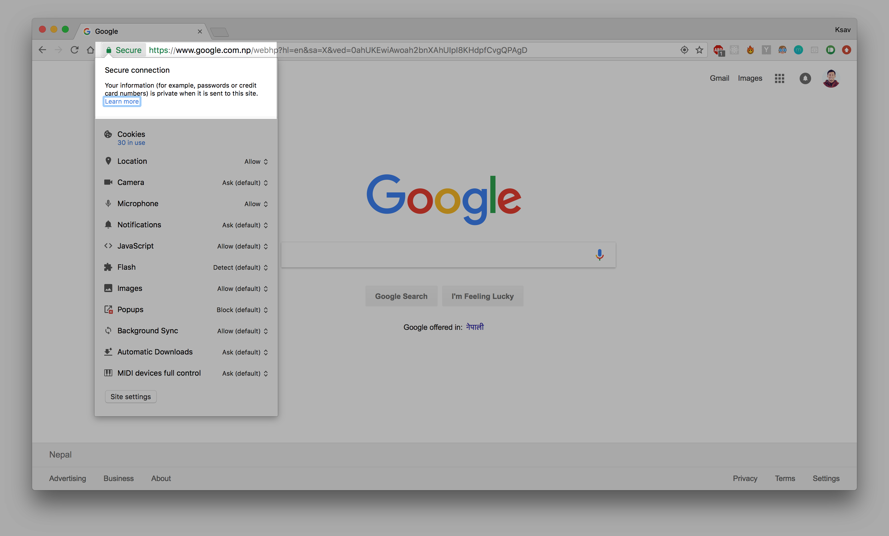

---
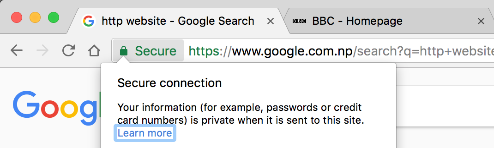

---
# [fit] http:// ⚔️ https://

---
# [fit] 4.1.1 Web Security Threats
# [fit] 4.1.2 Web Traffic Security Approaches

---
# 4.1.1 Web Security Threats

---
# Two way of grouping Web Security Threats
## > Nature of attack.
## > Location of Attack.

---
# Nature of attack.

---
## 1 Active Attack
## 2 Passive Attack

---
## Location of Attack.

---
# Client Server Architecture
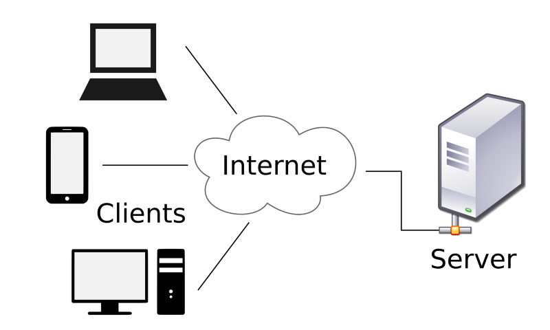

---
# 3 Locations for attack
1. Client
2. Server
3. Network

---
# In the context of web
1. Web browser
2. Web server
3. Network traffic in between them

---
# OSI **Reference** Model

---

---

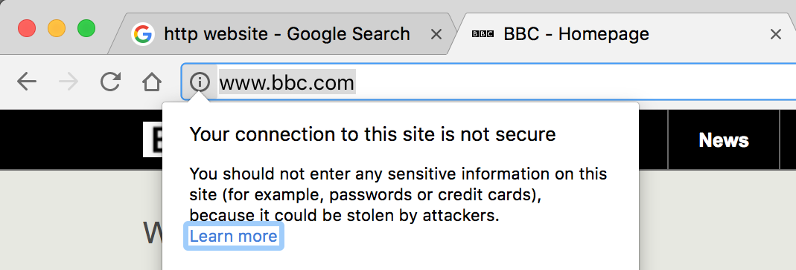

---
# SSL History
- SSL V1
- SSL V2
- SSL V3 / TLS V1.0
- TLS V1.1
- TLS V1.2 (Latest)
- TLS V1.3 (Draft)

---
# SSL Concepts
- SSL Connection
- SSL Session

---
# SSL Architecture
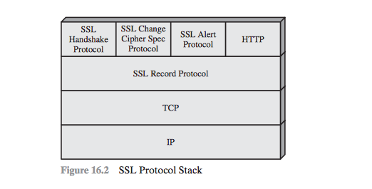

---
# SSL Architecture
- SSL Record Protocol
	1. The Change Cipher Spec Protocol
	- The Alert Protocol
	- The Handshake Protocol

---
# SSL Record Protocol
- Services
	- Message Integrity using MAC
	- Confidentiality using Symm. Enc.
- Operation (6 Steps)

---
<!-- # Operation (6 Steps) -->
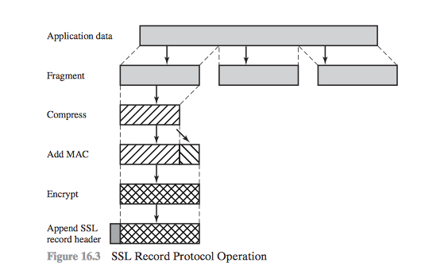

---
# Operation (6 Steps)
1. App Data from Application Layer
- Fragmentation
- Compass
- Add MAC
- Encrypt
- Add SSL Record Header

---
<!-- # 6. Add SSL Record Header -->
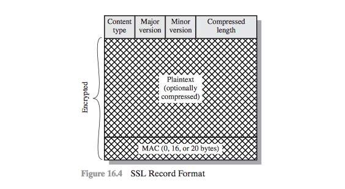

---
# SSL Record Header
- Content Type ('text/html', 'audio/mp3', 'image/png')
- Major Version
- Minor Version
- Compressed Length

---
# SSL Record Protocol
- 1. The Change Cipher Spec Protocol
- 2. The Alert Protocol
- 3. The Handshake Protocol

---
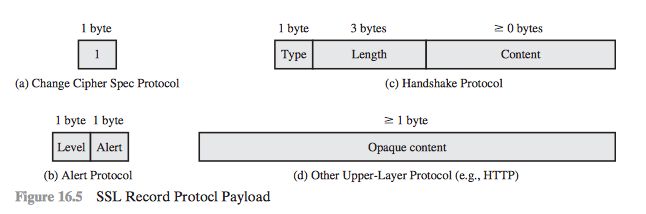

---
# 1. The Change Cipher Spec Protocol
- Simplest
- Consists of single message
- Single Byte with Value 1
- Causes the pending state to be copied into the current state, which updates the cipher suite to be used on this connection.

<!-- - Copies Pending State to the Current State -->

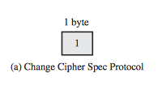

---
# 2. Alert Protocol
- Convey SSL alerts to the peer-entity
- 2 Bytes
- First Byte - Denotes level of the message
	- Warning
	- Fatal
- Alert code for specific alert

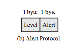

---
# 3. Handshake Protocol
- Size: Minimum 4 Bytes
- *Type* (1B) indicates one of 10 SSL Handshake Protocol Message Types
- *Length* (3B) indicates length of message in Bytes
- *Content* (>=0B) indicates the parameters associated with the messages

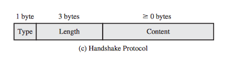

---
<!-- ### SSL HandShake Protocol Message Types -->
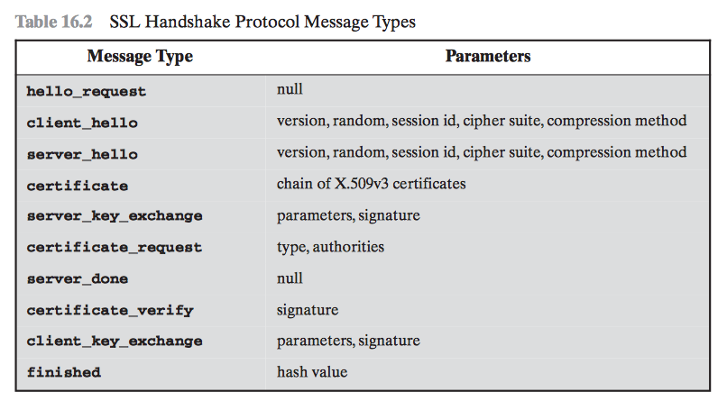

---
# 4 Phases of SSL Handshake
1. Establish Security Capabilities
2. Server Authentication and Key Exchange
3. Client Authentication and Key Exchange
4. Finish

---
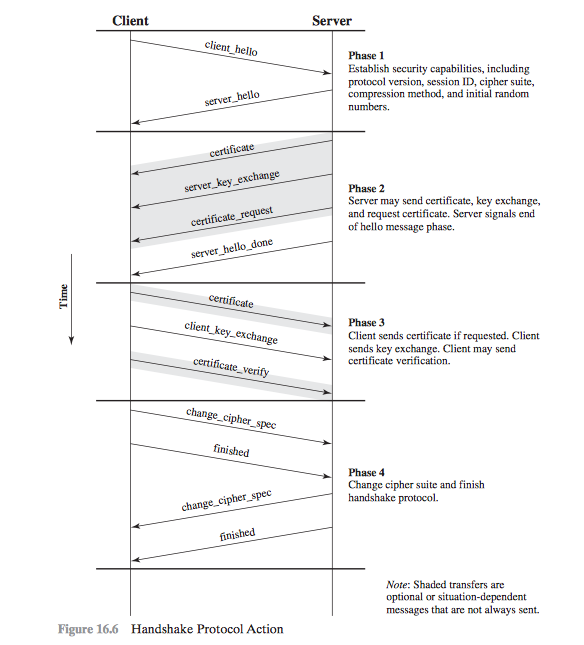

---
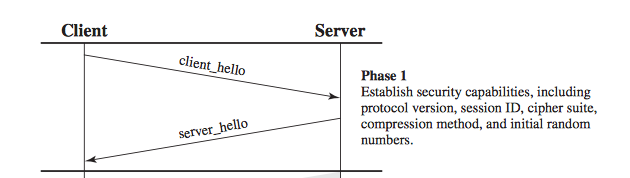

---
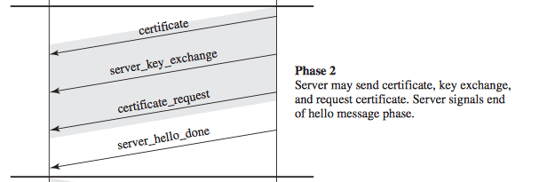

---
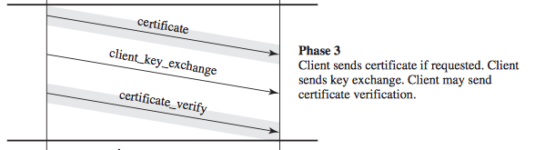

---
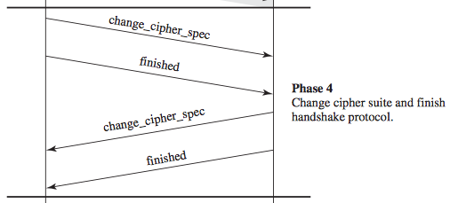

---
# Transport Layer Security (TLS)

