footer: *NS-U4-WIRELESS-NW-SEC*
slidenumbers: true
autoscale: true
build-lists: true

# BSCIT
# Network Security
# Unit 6
# Electronic Mail Security

---
## Unit 6
#[fit] Electronic Mail Security

<!-- --- -->
<!-- 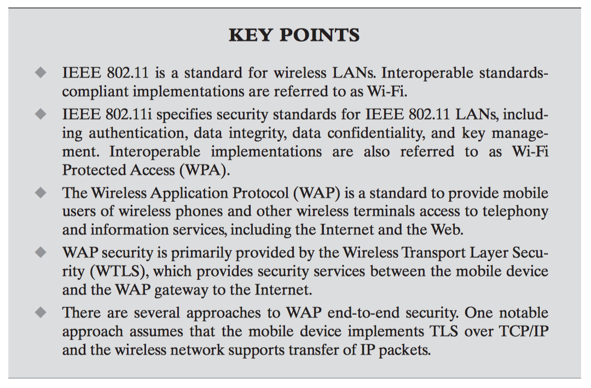 -->

<!-- List of Images first -->
<!--  -->

---
# 3 Topics
1. Pretty Good Privacy (PGP)
2. S/MIME
3. Domain Keys Identified Mail (DKIM)

---
# 1. Pretty Good Privacy (PGP)
- Authentication -> SHA/RSA
- Confidentiality -> DES / Diffie Hellman
- Compression
- E-mail Compatibility -> Radix64

---
# 2. S/MIME (Secure MIME)
<!-- - RFC 5322
- Multipurpose Internet Mail Extensions
- S/MIME Functionality
- S/MIME Messages
- S/MIME Certificate Processing
- Enhanced Security Services -->
- Multipurpose Internet Mail Extensions
	- Allowed media types to be encoded in emails
- S/MIME is very similar to PGP.
- Both offer the ability to sign and/or encrypt messages.

---
# S/MIME Functions

Create a message digest to be used in forming a digital signature.

Encrypt message digest to form a digital signature.

Encrypt session key for transmission with a message.

Encrypt message for transmission with a one-time session key.

Create a message authentication code.

<!-- • Enveloped data -->

<!-- : This consists of encrypted content of any type and encryptedcontent encryption keys for one or more recipients. -->

<!-- • Signed data -->

<!-- : A digital signature is formed by taking the message digest of the content to be signed and then encrypting that with the private key of the signer. The content plus signature are then encoded using base64 encoding. A signed data message can only be viewed by a recipient with S/MIME capability. -->

<!-- • Clear-signed data -->

<!-- : As with signed data, a digital signature of the content is formed. However, in this case, only the digital signature is encoded using base64.As a result, recipients without S/MIME capability can view the message content, although they cannot verify the signature. -->

<!-- • Signed and enveloped data -->

<!-- Signed-only and encrypted-only entities may be nested, so that encrypted data may be signed and signed data or clear-signed data may be encrypted. -->

---
# 3. Domain Keys Identified Mail (DKIM)

DomainKeys Identified Mail (DKIM) is a specification for cryptographically signing e-mail messages, permitting a signing domain to claim responsibility for a message in the mail stream.

---
# Internet Mail Architecture
- Message User Agent (MUA)
- Mail Submission Agent (MSA)
- Message Transfer Agent (MTA)
- Mail Delivery Agent (MDA)
- Message Store (MS)

---
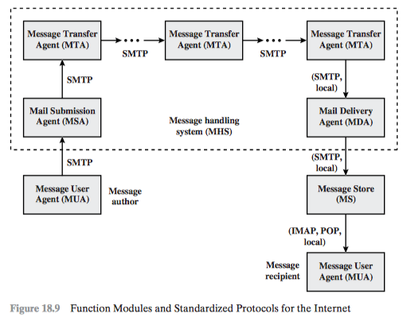

---
# Threats in email architecture

<!-- - characteristics
- capabilities
- location -->

---
# DKIM Strategy
DKIM allows good senders to prove that they did send a particular message and to prevent forgers from masquerading as good senders.

---
<!-- # DKIM Functional Flow -->

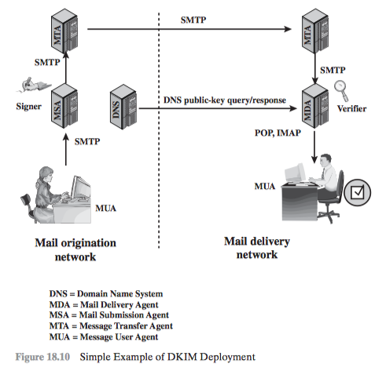

<!-- --- -->
<!--  -->

<!-- --- -->
<!-- # 1. Pretty Good Privacy (PGP) -->

<!-- --- -->
<!-- 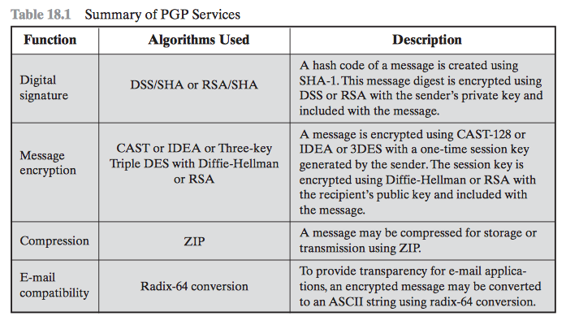 -->

<!-- --- -->
<!-- # General Format of PGP Message -->

<!-- --- -->

<!--

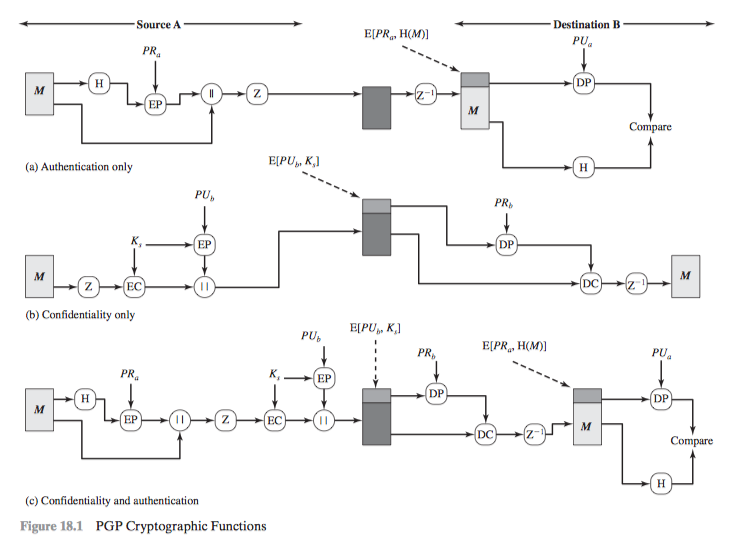
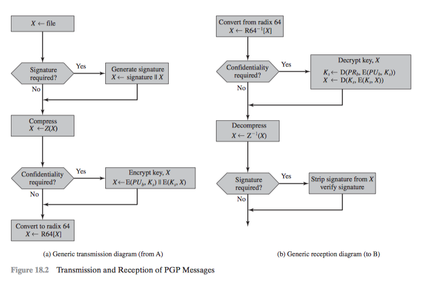
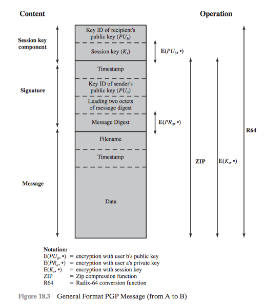
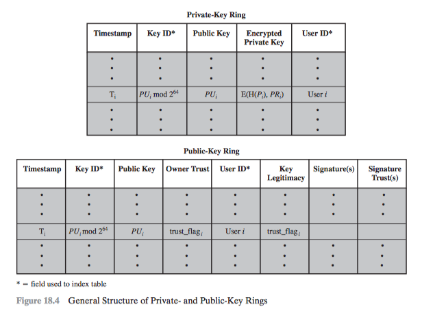

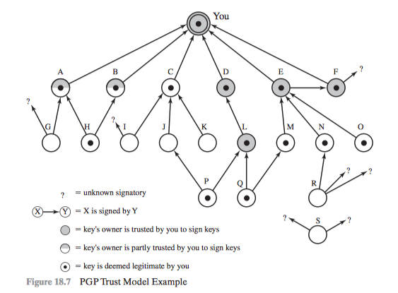

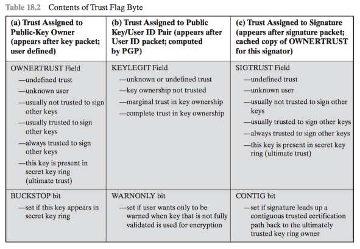
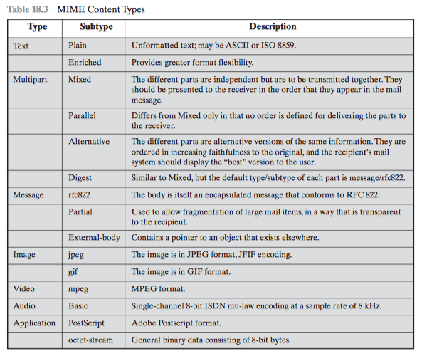
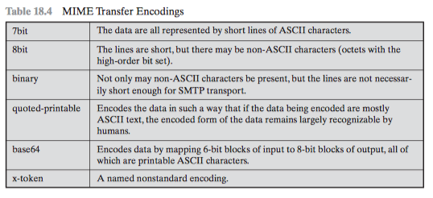
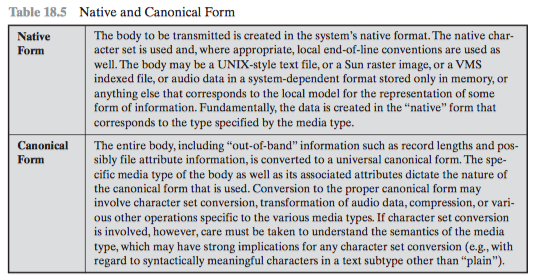
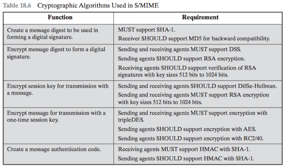
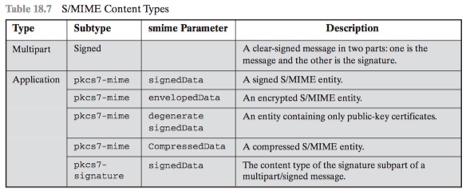

-->

