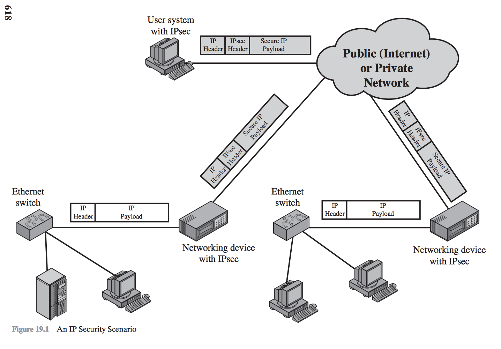
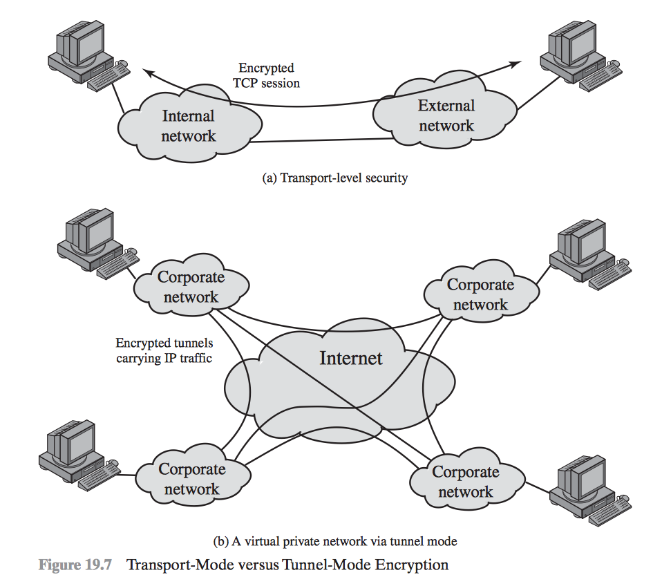
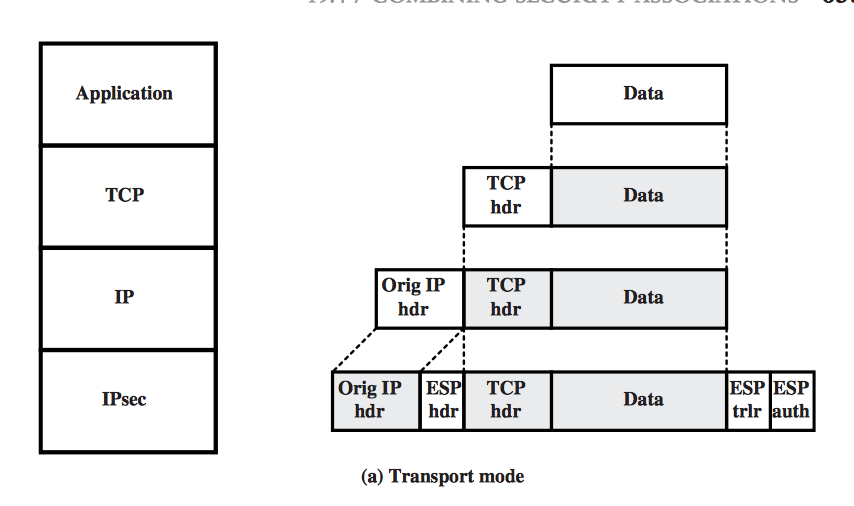
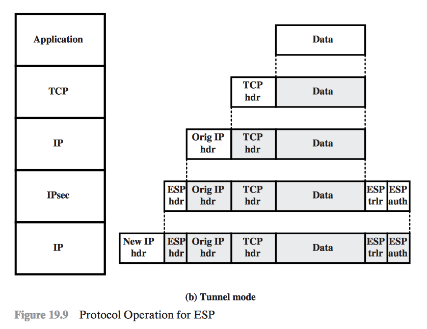

<!--footer: *NS-U4-WIRELESS-NW-SEC*-->
<!--slidenumbers: true-->
<!--autoscale: true-->
<!-- build-lists: true -->

<!-- # BSCIT
# Network Security
# Unit 7
# IP Security

--- -->
## Unit 7

# IP Security

## Unit Topics

1. IP Security Overview
2. IP Security Policy
3. Encapsulating Security Payload
4. Combining Security Associations
5. Internet Key Exchange
6. Cryptographic Suites

---
# 1. IP Security Overview

---
# Application of IPsec

* Secure branch office connectivity over the Internet
* Secure remote access over the Internet
* Establishing extranet and intranet connectivity with partners
* Enhancing electronic commerce security

---
# Benefits of IPsec

* When IPsec is implemented in a firewall or router, it provides strong security that can be applied to all traffic crossing the perimeter.Traffic within a company or workgroup does not incur the overhead of security-related processing.

* IPsec in a firewall is resistant to bypass if all traffic from the outside must use IP and the firewall is the only means of entrance from the Internet into the organization.

* IPsec is below the transport layer (TCP, UDP) and so is transparent to applications. There is no need to change software on a user or server system when IPsec is implemented in the firewall or router. Even if IPsec is implemented in end systems, upper-layer software, including applications, is not affected.

* IPsec can be transparent to end users.There is no need to train users on security mechanisms, issue keying material on a per-user basis, or revoke keying material when users leave the organization.

* IPsec can provide security for individual users if needed.This is useful for offsite workers and for setting up a secure virtual subnetwork within an organization for sensitive applications.

---
# Functional areas

- Authentication
- Confidentiality
- Key management

---
# IPsec Services

* Access control
* Connectionless integrity
* Data origin authentication
* Rejection of replayed packets
* Confidentiality (encryption)
* Limited traffic flow confidentiality

---
# Modes of IPsec

- Transport Mode
- Tunnel Mode

---

---

---

